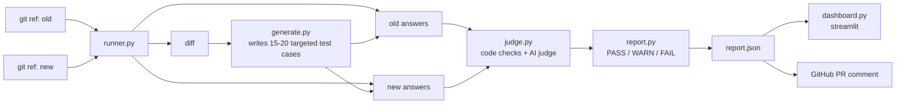

# GitGrounded

This project is from the BITSoM Vertex Builders Pitch Fest hackathon, Day 1, Software Automation AI Track. It solves:

> "How can AI applications be tested, evaluated, monitored, or improved more reliably?"
> "How can developers better manage prompts, models, agents, context, data, APIs, or AI workflows?"

[](https://github.com/amareshhebbar/gitgrounded/actions/workflows/tests.yml)
[](LICENSE)
[](https://www.python.org/)

## What this actually does

You have an AI chatbot or assistant. You change its instructions (the "prompt"), or you swap which AI model powers it. Did that change make it better or worse?

Normally you find out when a customer complains. GitGrounded tells you first — it asks an AI to write a batch of test questions aimed at your exact change, runs your old version and new version against those questions, has a second AI grade both sets of answers, and gives you one word: **PASS**, **WARN**, or **FAIL**.

Think of it like a spell-checker, but for AI prompts instead of text.

## The two ways to use it

**1. Git mode** — for your own code. You keep two versions of your prompt as two git branches. GitGrounded can literally see the diff between them, so it writes tests aimed at exactly what you changed.

**2. Endpoint mode** — for any live AI API, even one you don't control. GitGrounded can't see inside someone else's code, so instead it remembers what that API answered last time and checks if today's answers are still good.

---

## Architecture



---

## Quick start

```
python -m venv .venv
source .venv/bin/activate
pip install -r requirements.txt
cp .env.example .env
```

Open `.env` and fill in:
```
GITGROUNDED_MODE=dev
GROQ_API_KEY=
ANTHROPIC_API_KEY=
```

You don't need real API keys to try it out — use `test` mode first, it's free and instant:
```
GITGROUNDED_MODE=test python gitgrounded.py --demo citation --quick
```
If that prints a verdict at the end, everything's working.

**What are the three modes?**

| Mode | What it needs | When to use it |
|---|---|---|
| `test` | nothing | trying things out, running the test suite |
| `dev` | Ollama running on your computer | free local development |
| `demo` | Groq + Anthropic API keys | the real thing, real AI models |

Ollama setup, if you're using `dev` mode:
```
ollama pull qwen3:4b
ollama serve
```
(If your computer is low on GPU memory, use `qwen2.5:3b` instead — smaller and faster.)

Git mode needs your project to be a real git repo (`git init`, then commit once). Endpoint mode doesn't need git at all — it just needs a web address to call.

## A note on the provider name

The live-API demo uses **Groq** (groq.com — very fast AI hosting), which is a different company from **Grok** (xAI's chatbot). Easy to mix up. `GROQ_API_KEY` is the one you need; get it at console.groq.com/keys.

---

## All the commands, explained simply

| Command | In plain words |
|---|---|
| `--old X --new Y` | "Compare these two git branches of my app" |
| `--demo safe / citation / model` | "Run one of the three ready-made examples" |
| `--rank --old X A B C` | "Which of these git branches is the best?" |
| `--compare URL --label NAME` | "Check this one live API against what it said last time" |
| `--check` | "Check every API I've registered in gitgrounded.yml" |
| `--check URL` | "Check this one API, right now, no setup needed" |
| `--rank NAME` | "Has this one API been getting better or worse over time?" |
| `--labels` | "What APIs have I been tracking?" |
| `--del-v NAME` | "Forget everything I've recorded about this API" |
| `--del-v NAME 2` | "Forget just version 2 of this API's history" |
| `--del-v-all` | "Forget everything about every API" |
| `--quick` | "Use fewer test questions, so this runs faster" |
| `--app-module` | "Test my own app instead of the built-in example" |

### Comparing two of your own git branches

This is the main way to use GitGrounded on your own code.

```
git checkout -b baseline
git commit --allow-empty -m baseline

git checkout -b change-1
# now edit prompts/triage.txt, or config/model.yaml, however you like
git add -A && git commit -m "change 1"

python gitgrounded.py --old baseline --new change-1
```

Try it for free first, no API cost:
```
GITGROUNDED_MODE=test python gitgrounded.py --old baseline --new change-1 --quick
```

### The three ready-made examples

Three branches already exist in this repo showing three kinds of change:
```
python gitgrounded.py --demo safe        # a harmless wording tweak — should PASS
python gitgrounded.py --demo citation    # removes an important instruction — should FAIL
python gitgrounded.py --demo model       # swaps to a cheaper AI model — should FAIL
```

### Which version is best? (`--rank`, git mode)

Give it several branches, it tells you which one scored highest:
```
python gitgrounded.py --old baseline --rank test/safe-wording-tweak test/drop-citation-rule test/model-downgrade
```

### Checking a live API (`--compare`)

Point it at any web address that answers questions:
```
python gitgrounded.py --compare "https://your-api.com/chat" --label "my-app" --quick
```
The address just needs to accept `POST {"message": "..."}` and reply with some JSON — that's the only rule.

The first time you run this, there's nothing to compare against yet, so it just remembers what it saw ("version 1"). Run it again any time later, and it checks today's answers against that memory. `--label` is just a name you pick, so GitGrounded knows which API's history it's looking at.

### Checking several APIs at once (`--check` + `gitgrounded.yml`)

Instead of typing the address every time, list all your APIs once in a file called `gitgrounded.yml`:
```yaml
targets:
  ai-chatbot:
    endpoint: http://localhost:8765/ai-chatbot
    questions: data/seed_cases.json
  ai-chatbot2:
    endpoint: http://localhost:8765/ai-chatbot2
    questions: data/seed_cases.json
```
Then just run:
```
python gitgrounded.py --check
```
This checks every API in that list, one after another.

You can also skip the file and check one address directly:
```
python gitgrounded.py --check "http://localhost:8765/ai-chatbot"
```

**One thing to know:** if you check the same API both through the yaml file and directly by typing its address, GitGrounded treats them as two separate things with two separate histories. Stick to one way of calling it for the same API.

### Has an API gotten better or worse over time? (`--rank`, endpoint mode)

```
python gitgrounded.py --rank "ai-chatbot"
```
You need to have checked that API at least twice already for this to have anything to compare. It walks through every version you've saved and tells you, in plain words, whether each one was an improvement or a step backward.

### Managing what's been saved

```
python gitgrounded.py --labels
```
Shows every API you've ever checked, and which version number it's on.

```
python gitgrounded.py --del-v ai-chatbot2
```
Deletes everything saved for that one API.

```
python gitgrounded.py --del-v ai-chatbot2 2
```
Deletes just version 2 of that API's history, keeps the rest.

```
python gitgrounded.py --del-v-all
```
Deletes everything, for every API. Use this to start completely fresh.

### Testing your own app instead of the built-in example

`app/triage.py` is just a sample chatbot GitGrounded ships with, to demo against. To test your own app, write one function with this exact shape:

```python
def run(message, prompt_text, model_config, providers_config):
    # call your own AI, however you want
    return {"raw": raw_text, "parsed": parsed_dict_or_none, "valid_json": True_or_False}
```

Then tell GitGrounded to use it instead:
```
python gitgrounded.py --demo citation --app-module myapp.mymodule
```

---

## The example chatbot server

This repo includes `servers/chatbots.py` — three fake chatbots you can practice on, each with its own editable prompt file. Good for trying out endpoint mode before pointing it at something real.

Start it:
```
GITGROUNDED_MODE=dev python servers/chatbots.py
```

Check it's alive:
```
curl -X POST http://localhost:8765/ai-chatbot -H "Content-Type: application/json" -d '{"message":"hello"}'
```

Try the full loop — check it, change one of its prompts, check it again:
```
python gitgrounded.py --check --quick
echo "Keep every answer under 5 words." > servers/prompts/ai-chatbot2.txt
python gitgrounded.py --check --quick
```
The second check should show a real difference for `ai-chatbot2` only, since that's the one you edited.

---

## Running the test suite

```
pip install -r requirements.txt
pytest -v
```
22 tests, all free, no API keys needed. They use a fake AI provider so nothing costs money and nothing needs the internet. These same tests run automatically on GitHub every time code is pushed.

## Where things are saved

- `.cache/` — remembers AI answers so you don't pay to ask the same question twice (git mode)
- `.versions/` — the history endpoint mode keeps for each API you've checked

Both are safe to delete any time — GitGrounded will just start fresh and rebuild them.

## Automatic PR checks (optional)

If you push a pull request to GitHub, `.github/workflows/gitgrounded.yml` runs GitGrounded automatically and leaves a comment on the PR with the verdict. You'll need to add `GROQ_API_KEY` and `ANTHROPIC_API_KEY` as secrets in your repo's GitHub settings for this to work.

## What's in this folder

```
app/triage.py             the sample chatbot used in git mode
prompts/triage.txt        its instructions (this is what you'd edit)
config/model.yaml         which AI model to use, per mode
config/providers.yaml     API connection details
data/                     sample company policy + test questions
gitgrounded.yml           your list of APIs to check
servers/chatbots.py       the practice chatbot server
servers/prompts/          that server's editable instructions
gitgrounded/              the actual GitGrounded code
gitgrounded.py            the command you actually run
dashboard.py              a visual results viewer (streamlit run dashboard.py)
tests/                    the test suite
```