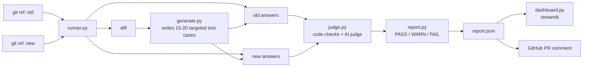

# GitGrounded

This project is from the hackathon from the bitsom vrtex program day 1, and here i am solving the problem

"How can AI applications be tested, evaluated, monitored, or improved more reliably?"
"How can developers better manage prompts, models, agents, context, data, APIs, or AI workflows?"

---

[](https://github.com/amareshhebbar/gitgrounded/actions/workflows/tests.yml)
[](LICENSE)
[](https://www.python.org/)

Tests an AI app before and after a prompt or model change, and tells you whether the change made it worse.

Change a prompt, swap a model, or edit a config — GitGrounded diffs the two git refs, has an LLM write fresh regression tests targeted at exactly what changed, runs both versions against them, and scores the result PASS / WARN / FAIL. A spell-checker for prompt changes.

## Architecture



Four providers sit behind one interface (`gitgrounded/llm.py`): Ollama for free local iteration, Groq for the app under test in the real demo, Claude for test generation and judging (different vendor on each side of the judge, so an AI isn't grading its own family leniently), and a deterministic mock for tests and CI.

## Local dev model — picked for low VRAM

Dev mode defaults to `qwen3:4b` on Ollama (~2.6 GB, Q4), not an 8B model — fits comfortably on a GTX 1060 / similar low-VRAM cards. If it's still tight, drop to `qwen2.5:3b` in `config/model.yaml`.

```
ollama pull qwen3:4b
```

## Setup

```
python -m venv .venv
source .venv/bin/activate
pip install -r requirements.txt
cp .env.example .env
```

Fill `.env`:

```
GITGROUNDED_MODE=dev
GROQ_API_KEY=
ANTHROPIC_API_KEY=
```

| Mode | Needs |
|---|---|
| `test` | nothing — fully mocked, used by the test suite and CI |
| `dev` | Ollama running locally: `ollama pull qwen3:4b` |
| `demo` | `GROQ_API_KEY` (console.groq.com/keys) and `ANTHROPIC_API_KEY` set |

This must be a git repo (`git init`, commit once) so `--old`/`--new` can resolve refs.

## Groq, not Grok

The "app under test" and the model-swap scenario run on **Groq** (console.groq.com — fast LPU inference hosting open-weight models), not xAI's Grok. `config/providers.yaml` points at Groq's OpenAI-compatible endpoint (`https://api.groq.com/openai/v1`), auth is `GROQ_API_KEY`.

Current default demo model: `openai/gpt-oss-120b`. For the model-downgrade demo, branch off and swap `config/model.yaml`'s `demo.model` to `openai/gpt-oss-20b` — smaller, cheaper, and the real place things break. (`llama-3.1-8b-instant` / `llama-3.3-70b-versatile` were deprecated by Groq on 2026-08-16 — don't use those IDs.)

## Run

```
git checkout -b baseline
git commit --allow-empty -m baseline

git checkout -b change-1
# edit prompts/triage.txt or config/model.yaml
git add -A && git commit -m "change 1"

python gitgrounded.py --old baseline --new change-1
streamlit run dashboard.py
```

`report.json` is written at the repo root and read by `dashboard.py`.

## Testing

```
pip install -r requirements.txt
pytest -v
```

22 tests, all offline, no API keys required — pure-logic unit tests for scoring/verdict/cache, plus one real end-to-end integration test that spins up a temp git repo with two branches and runs the full CLI through the mock provider. Same suite runs in CI on every push (`.github/workflows/tests.yml`).

## Switching modes

```
GITGROUNDED_MODE=dev python gitgrounded.py --old baseline --new change-1
GITGROUNDED_MODE=demo python gitgrounded.py --old baseline --new change-1
```

`config/model.yaml` holds the app's own provider/model per mode — change this file between two branches to simulate a model downgrade. `config/providers.yaml` holds the test-generator and judge provider/model per mode, plus the Ollama/Groq base URLs.

## Cache

Test-generation and judge calls are cached in `.cache/`, keyed by diff content and message pair. Delete `.cache/` to force a full re-run.

## GitHub PR check (optional)

`.github/workflows/gitgrounded.yml` runs GitGrounded on every PR into `main` and posts the verdict as a PR comment. Requires `GROQ_API_KEY` and `ANTHROPIC_API_KEY` as repo secrets.

## Layout

```
app/triage.py             the AI app being tested
prompts/triage.txt        prompt (changes between branches)
config/model.yaml         app provider/model per GITGROUNDED_MODE (changes between branches)
config/providers.yaml     test-gen/judge provider/model per mode, ollama/groq base urls
data/policy.md             fake company policy
data/seed_cases.json        10 baseline customer messages
gitgrounded/llm.py          routes to ollama / groq / claude / mock, retry + backoff
gitgrounded/cache.py        caches generated tests + judge scores per diff
gitgrounded/runner.py       runs old vs new versions via git refs
gitgrounded/generate.py     generates tests from the diff
gitgrounded/judge.py        code checks + AI judge
gitgrounded/report.py       combines scores into a verdict
gitgrounded.py              main command
dashboard.py                streamlit results page
tests/                      pytest suite, fully offline via the mock provider
```